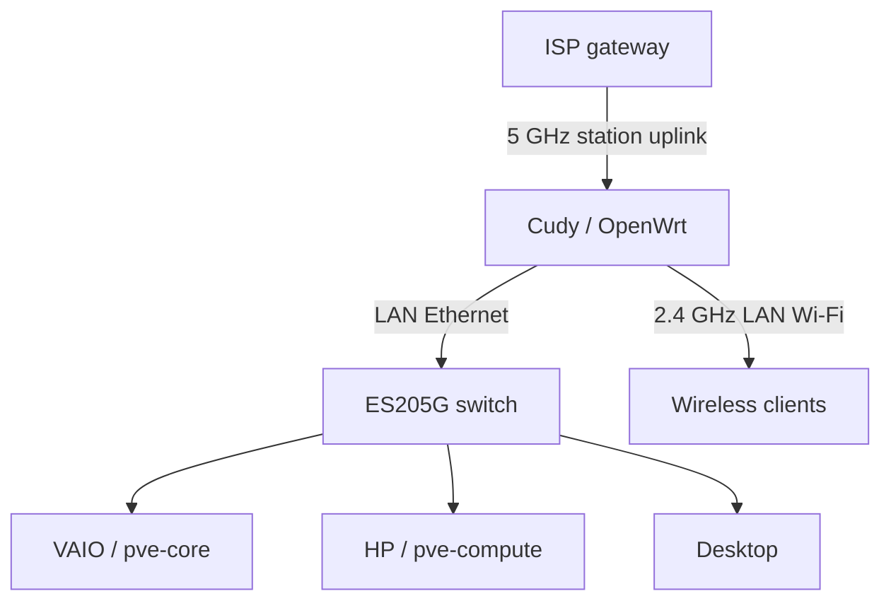
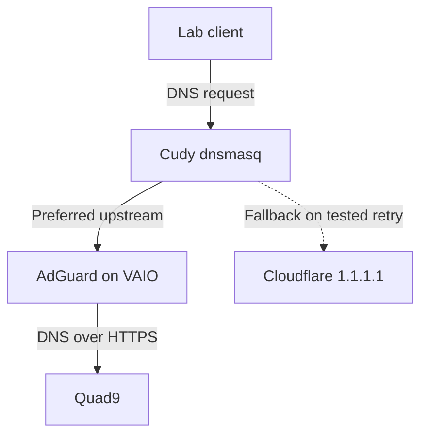

# Architecture and Availability

## Network connections

The Cudy routes between separate upstream and lab subnets. Its station uplink is not a transparent layer-2 bridge. The ordinary IPv4 arrangement has NAT at both routers; actual firewall rules and public IPv6 reachability have not been audited.

The ES205G provides Ethernet switching. Tagged trunks, LAN VLANs and isolated guest Wi-Fi remain planned.

## DNS path

Clients keep the router as DNS. Its ordered upstream file prefers AdGuard and supplies an independent public fallback. The recorded stopped-container test needed a client retry after three seconds. This is not a continuous health monitor or an instantaneous failover guarantee.

Each running/stopped/restored test cleared router caches. Cached public answers may remain after AdGuard returns, until TTL expiry. Filtering is absent on fallback. ISP Wi-Fi, manually chosen DNS, browser secure DNS and VPN settings can bypass this path; DNS enforcement is not configured.

## Services and management

| Location | Running component | Role |
|---|---|---|
| Cudy | OpenWrt routing, DHCP and dnsmasq | Network gateway and client DNS |
| VAIO | CT 100: AdGuard | Preferred filtering resolver |
| VAIO | CT 102: Tailscale | Lab subnet access |
| VAIO | CT 200: PDM | Management view of both hosts |
| HP | Proxmox VE | Capacity for future compute guests |

PDM manages two independent Proxmox hosts. It does not create a cluster, pool RAM/storage, replicate guests or provide HA. Both hosts can operate if PDM is down. One additional stopped container appeared in the dashboard; its purpose was not recorded.

Tailscale runs inside its own LXC, not on Cudy. Its advertised route requires approval in the Tailscale admin console. Default subnet-router SNAT was retained in the proposed configuration. No ISP inbound forwarding is required for this intended Tailscale approach.

## When the VAIO is off

| Function | Expected behavior | Evidence limit |
|---|---|---|
| Cudy routing, DHCP and Wi-Fi | Continues if router/upstream stay powered | Independent of VAIO |
| External DNS | Public fallback can resolve queries | Container shutdown tested; entire host shutdown not separately tested |
| AdGuard filtering | Unavailable | Resolver is on VAIO |
| Tailscale through this guest | Unavailable | Subnet router is on VAIO |
| PDM dashboard | Unavailable | PDM is on VAIO |
| HP and future guests | Can continue independently | No PVE cluster dependency |
| Future NPM URLs | Would stop if NPM runs on VAIO | NPM is not deployed |

The laptop battery does not supply the rest of the rack.

## Reverse proxy plan

Nginx Proxy Manager is intended for the VAIO. Cudy's limited persistent flash makes NPM a poor fit. Plain Nginx is smaller; the recorded decision was about NPM, not every possible Nginx deployment.

A reverse proxy can provide friendly HTTPS URLs. It does not close backend listeners or replace a firewall. Same-subnet services normally communicate through the switch without crossing Cudy's routed firewall; host firewalls and/or VLANs would be relevant to future restrictions.

No NPM installation, certificates, new port forwarding or access-control changes are recorded.

References: [OpenWrt routed client](https://openwrt.org/docs/guide-user/network/wifi/connect_client_wifi), [dnsmasq](https://dnsmasq.org/docs/dnsmasq-man.html), [PDM remotes](https://pdm.proxmox.com/docs/remotes.html), [Tailscale subnet routers](https://tailscale.com/docs/features/subnet-routers/how-to/setup), [NPM setup](https://nginxproxymanager.com/setup/).
