# Hardware Configuration Journal

This journal is a draft awaiting the new progress photographs. Steps described as planned or awaiting evidence must not be presented as completed until their results have been recorded.

## 01 - Hardware identification

**Goal:** Record the exact devices used in the build.

The router was identified as **Cudy WR3000 v1**, with an **EU1.0** label. The compute node is an **HP EliteDesk 705 G4 DM**. The selected Ethernet switch is a **TP-Link ES205G**.

**Evidence to add:** device model labels, switch hardware revision, HP specifications, and the physical build. Record model and hardware revision as text alongside photographs.

## 02 - OpenWrt installation

**Recorded outcome:** LuCI became accessible after installation, and the status page showed **OpenWrt 25.12.5** on **Cudy WR3000 v1**.

During the firmware transition, a browser tab continued showing a flashing/reboot message. A fresh incognito session reached LuCI. This observation showed that the old tab was not reliable evidence that flashing was still in progress.

**Evidence to add:** firmware filenames and source URLs, upload confirmation, LuCI login, and the final status page. Exact image checksums and the intermediate firmware version have not been recorded here.

This chapter records the installation result; it is not yet a complete flashing tutorial.


## 03 - LAN addressing and administration

**Goal:** Keep the homelab LAN separate from the upstream ISP network.

| Setting | Recorded value |
|---|---|
| Cudy LAN address | `192.168.2.1` |
| Subnet mask | `255.255.255.0` |
| DHCP start | `21` |
| DHCP limit | `234` |
| Resulting dynamic range | `192.168.2.21`–`192.168.2.254` |

LuCI was accessed at the new address. One address-change attempt caused LuCI's connectivity check to roll back the pending configuration; document the final successful method using the corresponding photograph.

**Evidence to add:** LAN configuration, DHCP pool, and an administration session at `192.168.2.1`.

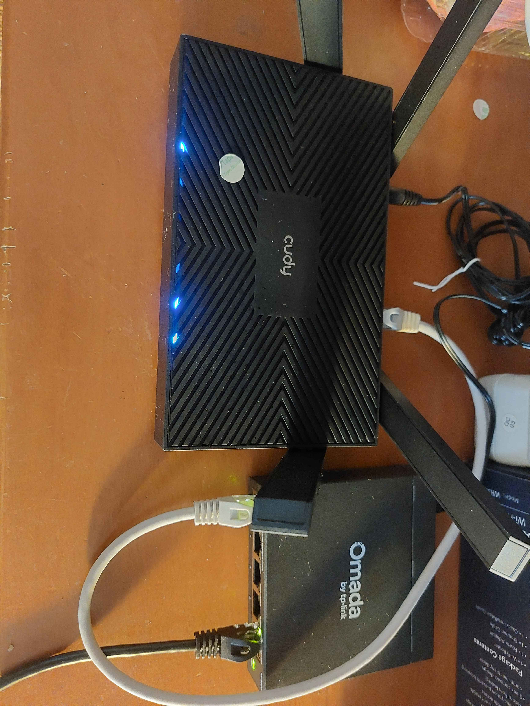

## 04 - Wireless ISP uplink

**Recorded outcome:** The Cudy connected to the ISP router over **5 GHz Wi-Fi**.

| Setting | Recorded value |
|---|---|
| Wireless operating mode | Client / station |
| Network interface | `wwan` |
| Address assignment | DHCP client |
| Firewall zone | `wan` |
| Upstream subnet | `192.168.1.0/24` |
| Upstream gateway | `192.168.1.1` |

A separate **2.4 GHz access point** was configured for the homelab LAN, with its own SSID and password. Internet access was reported as working.

**Evidence to add:** wireless scan results, client association, `wwan` address, the LAN access point and a connectivity result. Password fields should remain obscured in any published image.

## 05 - Router SSH and software inspection

Router SSH access uses:

```sh
ssh root@192.168.2.1
```

The package manager was used to compare installation plans:

```sh
apk update
apk add --simulate luci-proto-wireguard
apk add --simulate tailscale
```

| Simulated installation | New packages | Reported total package size afterward |
|---|---:|---:|
| WireGuard and its LuCI interface | 12 | 18.6 MiB |
| Tailscale | 2 | 43.3 MiB |

These are simulations, **not completed VPN installations**. The totals include existing packages and represent uncompressed package sizes. They are not the individual VPN package sizes or direct measurements of compressed flash usage.

The router's storage page showed approximately **5.6 MiB of free writable flash**. Its much larger temporary filesystem uses RAM; it does not expand persistent package storage.

**Evidence to add:** memory/storage status and the package simulation output. Never include private keys, authentication keys or passwords in terminal screenshots.

## 06 - Switch management address

**Selected configuration:** Give the switch a manual management address within the infrastructure allocation.

| Setting | Selected value |
|---|---|
| DHCP client | Disabled |
| Management IP | `192.168.2.2` |
| Subnet mask | `255.255.255.0` |
| Default gateway | `192.168.2.1` |
| DNS server, if exposed by firmware | `192.168.2.1` |

The documented menu is **System Info → IP Settings**. Applying the new address requires reconnecting at `http://192.168.2.2`. If the interface has a separate **Save** button, save the configuration after applying it.

Disabling DHCP here refers to the **switch's DHCP client**. The Cudy's DHCP server continues assigning addresses to LAN clients.

**Evidence to add:** the completed IP settings, a successful login at the new address, and confirmation that the address survives a switch restart. These checks have not yet been recorded in this draft.

## 07 - Desktop Ethernet connection

**Connection plan:** Cudy LAN → switch port 1 using 0.5 m Cat6; switch port 5 → desktop using the long Cat6 cable.

For a clean test, turn off the desktop's Wi-Fi and leave its Ethernet IP/DNS settings on automatic.

```cmd
ipconfig /all
ping 192.168.2.1
ping 192.168.2.2
nslookup example.com
```

| Check | Expected result |
|---|---|
| Ethernet IPv4 | An address in `192.168.2.0/24` |
| Subnet mask | `255.255.255.0` | 
| Default gateway | `192.168.2.1` |
| Router administration | LuCI opens at `192.168.2.1` | 
| Switch administration | Web interface opens at `192.168.2.2` | 
| Internet and DNS | A website loads with desktop Wi-Fi off |

The ISP uplink remains wireless even after the desktop and switch are wired.

## 08 - Server nodes

**HP compute node:** Purchased with Ryzen 5 PRO 2400G, 8 GB RAM and 256 GB NVMe. Record the installed OS, disk layout, network address and services when configured.

**Vaio:** The laptop is running **Proxmox VE** and was connected to the switch on 6 October 2026. The management address was changed to **`192.168.2.3/24`**, and the user successfully accessed **`https://192.168.2.3:8006`**. The Proxmox version and final workloads still need to be recorded.

Read-only checks for recording the final interface and route configuration are:

```sh
ip -br addr
ip route
cat /etc/network/interfaces
```

In a typical Proxmox installation, the management address is assigned to a Linux bridge such as `vmbr0`. Plugging the host into another network does not necessarily update a manually configured address. Inspect the existing configuration before editing it.

The host previously had the reported address `192.168.1.50` and gateway `192.168.1.0`; the latter is a network address for a `/24`, rather than a valid host gateway. The recommended gateway and DNS on the new LAN are `192.168.2.1`. Successful web access confirms the new management address; the final default route and DNS configuration still need direct evidence.

**Service progress:** AdGuard Home runs at `192.168.2.5`. Direct DNS resolution, forwarding/blocking through Cudy, external fallback with CT 100 stopped, and restoration after CT 100 restart and router cache clearing are demonstrated in chapters 10–13. Whole-Vaio shutdown has not been tested. Tailscale remote access at `192.168.2.6` remains pending. Reverse proxy and dashboards remain possible later workloads.

**Evidence to add:** specifications, installation screens and final storage/RAM configuration. DNS resolution and the three DNS-path tests are recorded in chapter 13; VPN access remains unvalidated. Jellyfin and file syncing remain planned options.

## 09 - AdGuard Home container creation

**Recorded status:** Five screenshots show the Proxmox LXC creation wizard for an intended AdGuard Home container. They do not show the final task result, a running container, or an installed AdGuard Home service. Template and CPU selections are not visible.

| Setting | Observed in screenshots | Recommended next setting |
|---|---|---|
| Node | `proxvault` | Keep |
| CT ID | `100` | Keep if available |
| Hostname | `AdGuard` | `adguard` for consistent naming |
| Unprivileged | Selected | Keep |
| Nesting | Selected | Not required for the planned native AdGuard Home installation |
| Storage / disk | `local-lvm`, 5 GiB | Keep; monitor log growth |
| RAM / swap limit | 1000 MiB / 512 MiB | 512 MiB RAM is a starting allocation; 1000 MiB is also valid |
| Network bridge | `vmbr0` | Keep |
| IPv4 address | `192.168.2.5/24` | Keep: user-assigned AdGuard Home address |
| IPv4 gateway | `192.168.2.1` | Keep |
| VLAN tag | None | Keep for the current unsegmented LAN |
| Firewall flag | Selected | Keep; actual filtering depends on Proxmox firewall configuration |
| Container DNS | Inherit host settings | Explicit independent resolver, such as `1.1.1.1`, for this DNS-service container |

The container DNS field controls name resolution for the container's own OS. It does not configure the DNS addresses advertised to LAN clients or the upstream resolvers used by AdGuard Home.

The user confirmed the final address plan on 6 October 2026: router `.1`, switch `.2`, Vaio `.3`, future mini PC server `.4`, AdGuard Home `.5`, and Tailscale `.6`, all within `192.168.2.0/24`. The captured AdGuard address matches this plan and should remain `192.168.2.5/24`. AdGuard initial setup uses `http://192.168.2.5:3000`; after selecting web port 80, administration uses `http://192.168.2.5`. Chapter 10 records the later successful DNS tests.

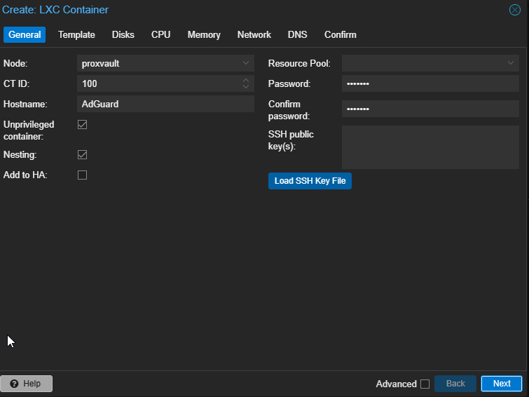

General: CT 100, hostname AdGuard, unprivileged and nesting selected.

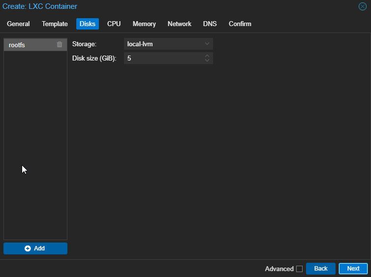

Disk: 5 GiB on local-lvm.

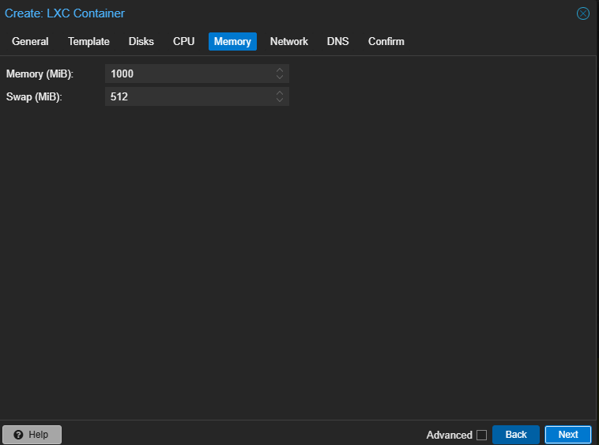

Memory: 1000 MiB RAM and 512 MiB swap limit.

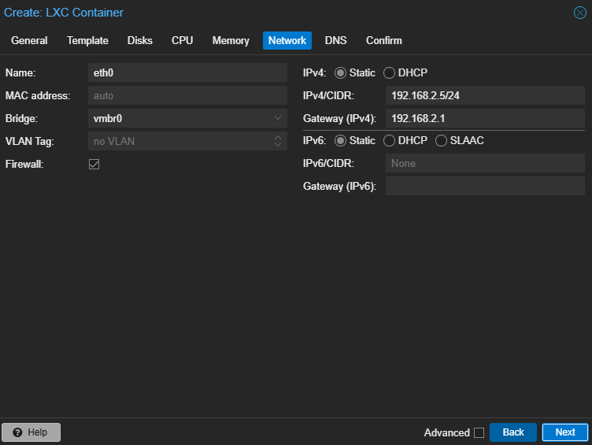

Network: vmbr0, static 192.168.2.5/24, gateway 192.168.2.1, no VLAN tag.

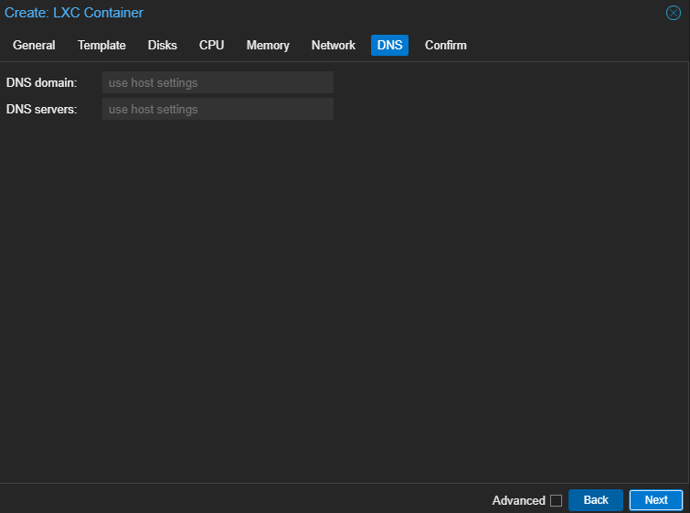

DNS: host settings inherited in the wizard.

## 10 - AdGuard Home direct DNS validation

**Recorded outcome:** On 6 October 2026, the AdGuard setup page showed its DNS listener at `192.168.2.5`. The desktop then successfully queried that address for both `google.com` and `example.com`.

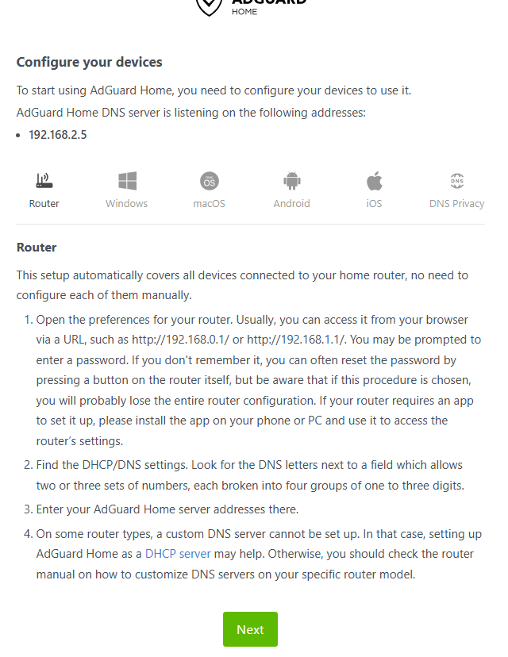

The Router tab contains manual device-configuration instructions. Viewing that tab does not apply settings to OpenWrt.

```powershell
nslookup google.com 192.168.2.5
nslookup example.com 192.168.2.5
```

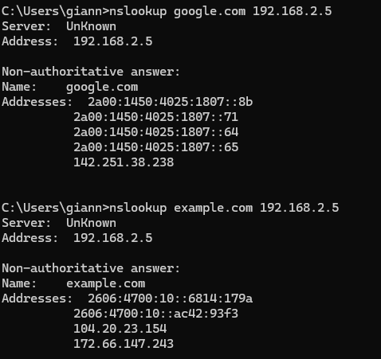

| Observation | Recorded result |
|---|---|
| DNS server queried | `192.168.2.5` |
| `google.com` lookup | Returned IPv4 and IPv6 addresses without timeout |
| `example.com` lookup | Returned IPv4 and IPv6 addresses without timeout |
| Displayed server name | `UnKnown`; server address remained correctly shown as `.5` |
| Router forwarding / fallback | Not configured or tested in this evidence |
| Ad blocking behavior | Not established by these successful lookups |

The returned IPv6 addresses are DNS records; these tests do not establish working IPv6 connectivity. The displayed `UnKnown` name is consistent with an unavailable reverse DNS name for the local DNS server, rather than a failed forward lookup.

**Next configuration:** Keep LAN clients using Cudy DNS at `192.168.2.1`. Prefer AdGuard at `192.168.2.5` upstream, with an independent external fallback. Inspect the current OpenWrt dnsmasq configuration and validate upstream ordering before applying changes. Test forwarding with AdGuard running, stopped and restarted. Tailscale deployment at `192.168.2.6` follows separately.

## 11 - DNS forwarding prerequisites and reasoning

**Observed on 6 October 2026:** The router's current configuration, dnsmasq build information, direct public-DNS lookup and AdGuard upstream were inspected before changing the lab's DNS path. These checks establish prerequisites; they do not demonstrate configured or tested failover.

| Output | Why inspect it? | Observation and implication |
|---|---|---|
| `uci show dhcp` | Inspect persistent DHCP/DNS configuration and identify settings that must be preserved. | One dnsmasq instance; LAN DHCP start 21, limit 234, lease time 12h. The pool remains `.21`–`.254`, outside the infrastructure allocation. Upstreams currently come from `/tmp/resolv.conf.d/resolv.conf.auto`; no explicit AdGuard upstream or strict-order setting is present. |
| `dnsmasq --version` | Confirm the installed version and compiled features before selecting configuration options. | Version 2.93; DNS and DHCP available, with loop detection compiled. DNSSEC validation and dnsmasq's own DHCPv6 support are not compiled; OpenWrt has a separate odhcpd configuration for IPv6. No package change was made. |
| `nslookup example.com 1.1.1.1` on the Cudy | Test whether the router can contact an independent external resolver, rather than relying only on a configured address. | Successful IPv4 and IPv6 DNS answers. Cloudflare DNS is reachable from the router at the time of this test. Returned AAAA records do not establish IPv6 connectivity. |
| AdGuard upstream settings | Identify where AdGuard sends queries and avoid creating a circular dependency. | The displayed upstream is `https://dns10.quad9.net/dns-query`, a direct DNS-over-HTTPS endpoint. It does not point general queries back to the Cudy. Bootstrap and private reverse-DNS settings are not shown. |

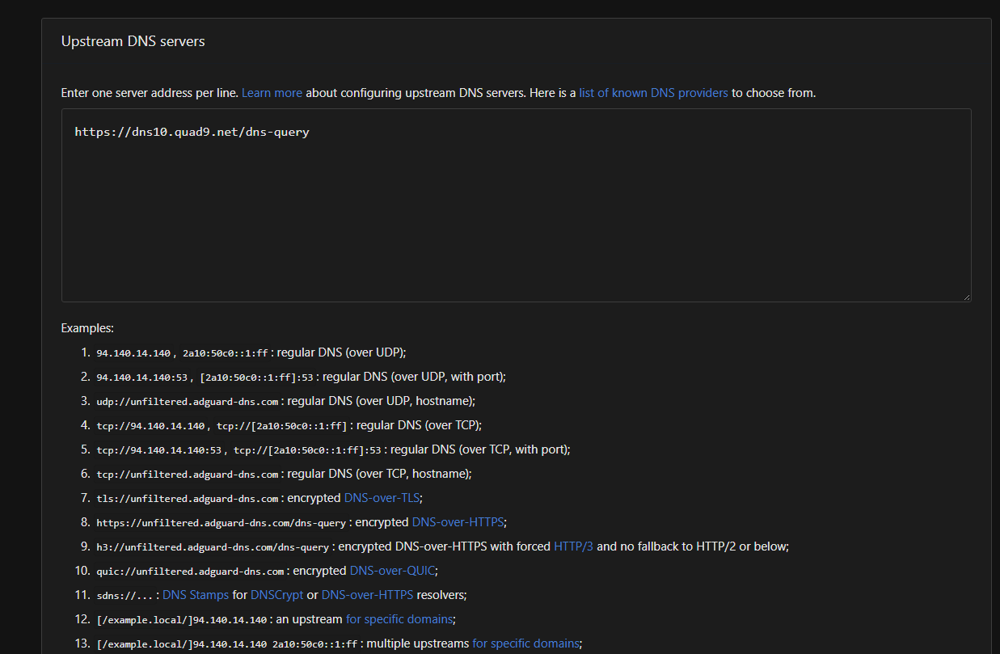

AdGuard upstream: the displayed public upstream is Quad9 over HTTPS.

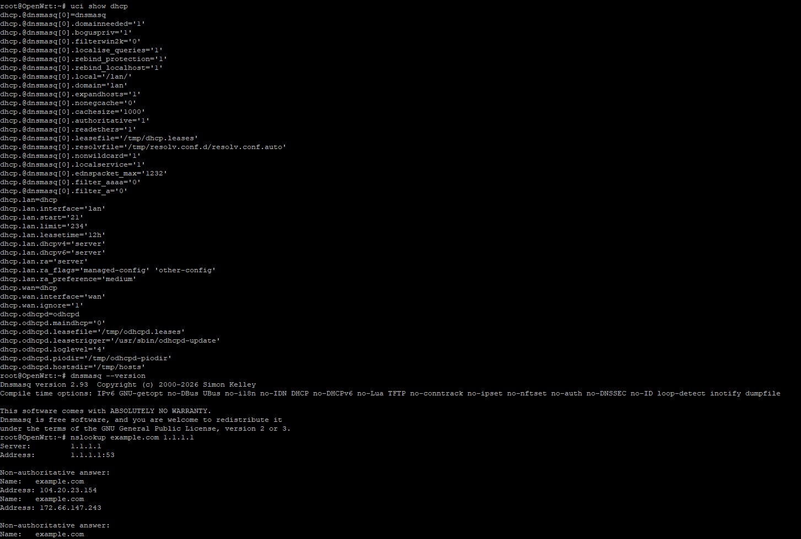

Router inspection: existing DHCP settings, dnsmasq 2.93 compile options and the direct lookup against `1.1.1.1`.

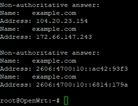

The completed lookup returned A and AAAA records without a timeout.

**Selected next design, not yet applied:** LAN clients query Cudy at `192.168.2.1`. Cudy prefers AdGuard at `192.168.2.5`, and uses an independent public resolver if AdGuard is unavailable. AdGuard resolves allowed queries through Quad9. General upstream queries must not follow the loop Cudy → AdGuard → Cudy.

Dnsmasq's default upstream selection does not guarantee that AdGuard is preferred. Its documented `strict-order` setting tries servers in resolver-file order. An ordered resolver file avoids assuming that a GUI or command-line server list preserves that order. Default retry behavior relies on client retries, so failover timing requires a live test; instantaneous recovery has not been established.

**Remaining validation:** Apply ordered forwarding; verify a fresh client query appears in AdGuard's query log; stop only the AdGuard container and verify an uncached lookup uses the external fallback; restart AdGuard and verify filtering resumes. Router caches and cached client answers must be accounted for when testing. DHCP remains on Cudy. Tailscale at `192.168.2.6` remains a separate pending task.

References: [dnsmasq manual](https://dnsmasq.org/docs/dnsmasq-man.html), [AdGuard Home configuration](https://adguard-dns.io/kb/adguard-home/configuration/).

## 12 - Queries received from the Cudy and command explanations

**Observed on 6 October 2026, around 19:15 Europe/Athens:** AdGuard's query log shows recent requests for Google, Discord and Spotify domains. Every displayed client is `192.168.2.1`, the Cudy. The times shown in the screenshot match the user's reported local time.

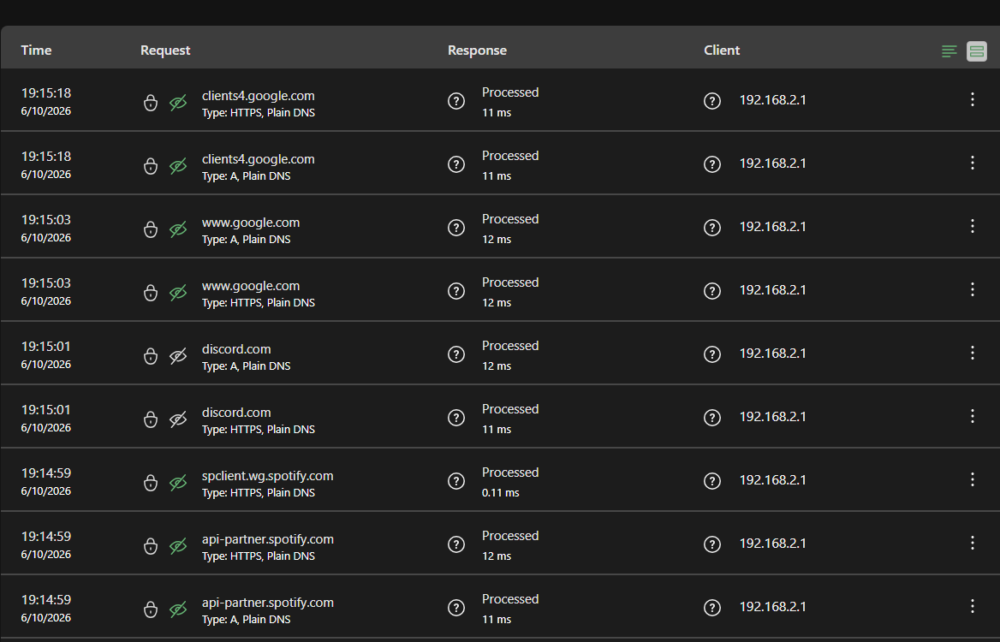

This establishes that AdGuard receives and processes DNS queries from the router. It is consistent with the selected forwarding design, but the screenshot alone does not distinguish requests made by the router itself from requests forwarded for LAN clients. It does not prove that every device uses this path, that the exact ordered-forwarding commands were applied, that an ad domain was blocked, or that fallback works with AdGuard stopped.

When Cudy forwards clients' queries, AdGuard sees Cudy as the requesting client. Per-device query statistics are therefore aggregated under the router in this design. Entries marked `Processed` are not evidence of a blocking test. `A` denotes an IPv4-address lookup. `HTTPS` denotes a DNS resource-record type containing connection information; it is distinct from DNS-over-HTTPS transport. `Plain DNS` describes the incoming router-to-AdGuard DNS transport, while the selected AdGuard-to-Quad9 upstream uses HTTPS.

### Meaning of the proposed router commands

The commands below were provided for the user to run on Cudy. They are recorded as instructions, not as remotely executed or individually verified commands.

```sh
test -e /etc/config/dhcp.before-adguard ||
    cp /etc/config/dhcp /etc/config/dhcp.before-adguard

cat > /etc/homelab-dns-upstreams.conf <<'EOF'
nameserver 192.168.2.5
nameserver 1.1.1.1
EOF

uci set 'dhcp.@dnsmasq[0].resolvfile=/etc/homelab-dns-upstreams.conf'
uci set 'dhcp.@dnsmasq[0].noresolv=0'
uci set 'dhcp.@dnsmasq[0].strictorder=1'
uci set 'dhcp.@dnsmasq[0].allservers=0'
uci set 'dhcp.@dnsmasq[0].localuse=1'
uci commit dhcp
/etc/init.d/dnsmasq restart
```

| Command or setting | Meaning |
|---|---|
| `test -e ... || cp ...` | Check whether the backup exists; copy the current DHCP/DNS configuration only if it does not. An earlier backup is preserved. |
| `cat > ... <<'EOF'` | Create or overwrite the file with the literal lines up to the closing `EOF`. |
| `nameserver` lines | File contents defining AdGuard first and Cloudflare second, rather than shell commands. |
| `uci set` | Stage a change through OpenWrt's configuration interface. `dhcp` is the configuration file; `@dnsmasq[0]` selects its first dnsmasq section. |
| `resolvfile=...` | Read upstream resolver addresses from the specified custom file. |
| `noresolv=0` | Leave resolver-file reading enabled; zero disables the option named noresolv. |
| `strictorder=1` | Try upstream resolvers in file order. Retry and failure behavior still need a live test. |
| `allservers=0` | Disable sending each query to all upstreams simultaneously. |
| `localuse=1` | Make the router's own default name resolution use its local dnsmasq service. |
| `uci commit dhcp` | Save the staged configuration persistently. |
| `/etc/init.d/dnsmasq restart` | Restart the dnsmasq service to apply the settings; does not reboot the router. |

The desktop test `nslookup example.net 192.168.2.1` explicitly queries Cudy. It does not change or verify the desktop's default DNS setting. To inspect default behavior, run `ipconfig /all` and `nslookup example.net` without a server argument, then check AdGuard's log. Cached router responses might not appear as new upstream requests.

### Coverage of wired and wireless devices

For the current unsegmented LAN, clients obtaining DNS automatically from Cudy should use `192.168.2.1`, whether they connect through the Ethernet switch or the Cudy's LAN Wi-Fi. The router forwards uncached public-domain queries to AdGuard when available. Clients therefore continue to display Cudy as their configured DNS address; AdGuard supplies filtering upstream.

Devices connected directly to ISP Wi-Fi are on the upstream ISP network and are not covered by this configuration. A manually selected external resolver, externally directed secure/private DNS, or VPN-provided DNS may bypass the router's chosen DNS path. Future guest networks or VLANs need their own DHCP/DNS and firewall checks. No DNS-enforcement firewall rules have been applied in this journal.

**Still pending:** Test a query from a default-configured wired client and a Cudy Wi-Fi client; test blocking using a known configured rule; stop only CT 100 and validate external fallback using uncached queries; restart CT 100 and confirm the preferred route returns. Filtering is unavailable while requests use the public fallback.

References: [OpenWrt DHCP/DNS configuration](https://openwrt.org/docs/guide-user/base-system/dhcp), [dnsmasq manual](https://dnsmasq.org/docs/dnsmasq-man.html), [RFC 9460: HTTPS DNS records](https://www.rfc-editor.org/rfc/rfc9460.html), [Firefox DNS over HTTPS](https://support.mozilla.org/en-US/kb/firefox-dns-over-https).

## 13 - DNS forwarding and failover validation

### A: AdGuard running - passed

**Observed on 6 October 2026 around 19:31 Europe/Athens:** A desktop query through Cudy returned the blocking address `0.0.0.0` for `example.net`. The router log records the same query from `192.168.2.199`, forwarding to AdGuard at `192.168.2.5`, and the reply `0.0.0.0`. This validates router forwarding and the expected blocking response for the temporary `||example.net^` rule. The AdGuard query-log view of the matched rule was not supplied in this step.

```powershell
nslookup -type=A -timeout=3 -retry=3 example.net. 192.168.2.1
```

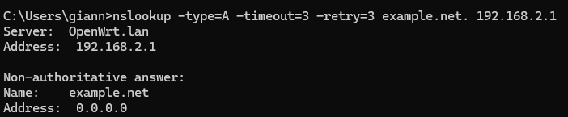

The queried DNS server is `OpenWrt.lan`, address `192.168.2.1`. The answer for `example.net` is `0.0.0.0`.

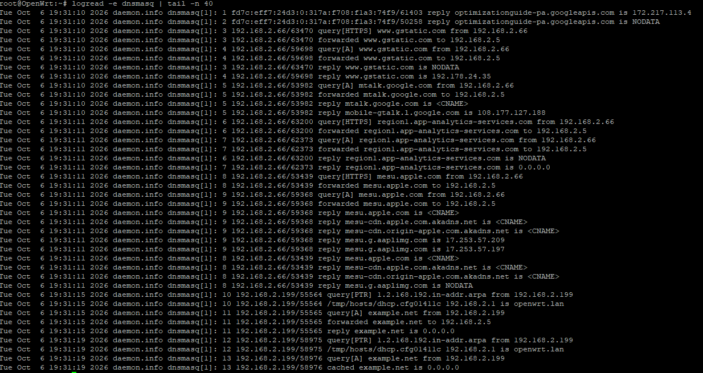

The relevant request at 19:31:15 follows this sequence:

```text
query[A] example.net from 192.168.2.199
forwarded example.net to 192.168.2.5
reply example.net is 0.0.0.0
```

At 19:31:19 a repeated lookup is answered from Cudy's cache as `0.0.0.0`. Clear that cache before testing AdGuard shutdown; otherwise a cached blocked answer could conceal the fallback behavior.

### B: AdGuard container stopped - passed with a client retry

In Proxmox, shut down only CT 100 and wait until its status is stopped. Keep Cudy and the Vaio host running. Restart dnsmasq on Cudy to clear the cached blocking response, repeat the desktop lookup, and inspect the matching router logs:

```sh
/etc/init.d/dnsmasq restart
```

```powershell
nslookup -type=A -timeout=3 -retry=3 example.net. 192.168.2.1
```

```sh
logread -e dnsmasq | grep 'example.net' | tail -n 15
```

**Observed on 6 October 2026 around 19:35 Europe/Athens:** The user reported CT 100 stopped. The first request was forwarded to `.5` at 19:35:44. At 19:35:47 the router received a repeated query and forwarded it to `1.1.1.1`. Public answers `104.20.21.8` and `172.66.175.59` followed in the same second. Windows displayed one three-second timeout before the successful answer.

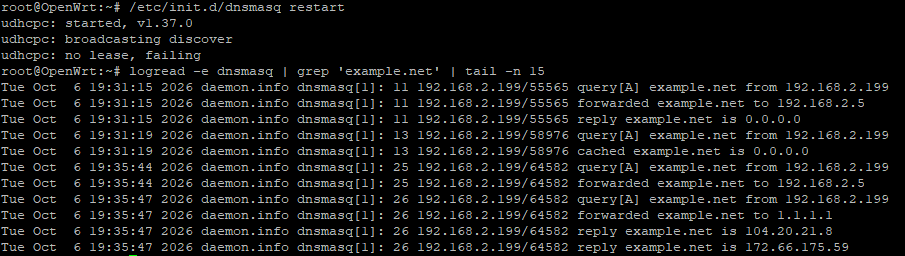

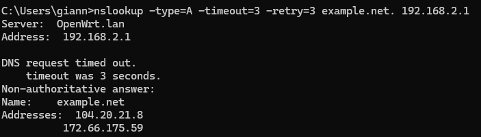

| Time | Observed event |
|---|---|
| 19:35:44 | Query from `192.168.2.199` forwarded to AdGuard at `.5`. |
| 19:35:47 | Repeated query forwarded to external fallback `1.1.1.1`. |
| 19:35:47 | Public IPv4 answers returned. |

This establishes external fallback for the tested lookup with the AdGuard container stopped and Cudy's cache cleared. It does not establish zero-delay failover or identical behavior for every application. The observed fallback depends on the Windows client's retry after three seconds; strict-order is not a global health check that permanently switches all future requests to the fallback. New uncached queries may incur a delay while AdGuard remains unavailable. Filtering is bypassed during this public-fallback path.

The `udhcpc: no lease, failing` line also appears during dnsmasq restart. OpenWrt's startup script uses a DHCP-client probe to check for another DHCP server on a LAN interface, which is consistent with this message; the displayed message alone does not establish an ISP lease failure. The successful public-DNS exchange demonstrates upstream connectivity during the lookup.

References: [dnsmasq retry behavior](https://dnsmasq.org/docs/dnsmasq-man.html), [OpenWrt dnsmasq startup script and DHCP probe](https://git.openwrt.org/openwrt/staging/hauke/tree/?path=package/network/services/dnsmasq/files/dnsmasq.init).

### C: AdGuard restarted - passed after cache clearing

**Observed on 6 October 2026 at 19:40:55 Europe/Athens:** The user reported CT 100 started again. After restarting dnsmasq to clear Cudy's cache, a desktop query from `192.168.2.199` was forwarded to `.5` and received the blocking answer `0.0.0.0`. The desktop lookup displayed that answer with no timeout message.

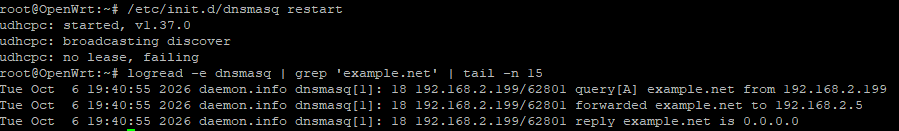

```text
19:40:55 query[A] example.net from 192.168.2.199
19:40:55 forwarded example.net to 192.168.2.5
19:40:55 reply example.net is 0.0.0.0
```

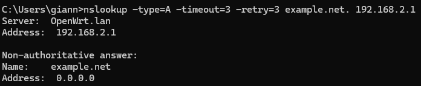

| Scenario | Recorded result |
|---|---|
| AdGuard running | Passed: `.5` supplied the blocking answer. |
| AdGuard container stopped | Passed: public fallback `1.1.1.1` supplied IPv4 answers after one three-second client timeout. |
| AdGuard container restarted | Passed after router cache clearing: `.5` supplied the blocking answer again, with no displayed timeout. |

These tests validate the selected DNS paths for the tested desktop A-record lookup. Each scenario was run after a dnsmasq restart to clear router caches; recovery during an uninterrupted running dnsmasq instance and its existing caches was not separately tested. Cached public answers may persist until their TTL expires after AdGuard returns. No guarantee of instant failover or identical application retry behavior is implied.

### Test cleanup - instructions supplied, completion not yet recorded

1. In AdGuard's custom filtering rules, remove only the temporary `||example.net^` rule and apply the change.
2. On Cudy, disable diagnostic logging and restart dnsmasq to clear the cached blocking answer:

```sh
uci set 'dhcp.@dnsmasq[0].logqueries=0'
uci commit dhcp
/etc/init.d/dnsmasq restart
```

3. From the desktop, confirm the test domain resolves to public addresses again with AdGuard still running:

```powershell
nslookup -type=A example.net. 192.168.2.1
```

Whole-Vaio shutdown and a live AdGuard instance with an unavailable Quad9 upstream have not been tested. Per-device default-DNS coverage has not been established for every wired/wireless device. Tailscale remains planned at `192.168.2.6`.

## Screenshot captions

Use a caption that identifies the device, action and observable result. For example:

> Switch management addressing: the IP settings page shows `192.168.2.2/24`, DHCP disabled and gateway `192.168.2.1`.

Once the relevant image has been added, embed it with a relative path:

```markdown

```

The AdGuard creation-wizard screenshots are embedded in chapter 09; setup and direct DNS tests are embedded in chapter 10; DNS prerequisite checks are embedded in chapter 11; router-client query logs are embedded in chapter 12; the running, stopped and restarted AdGuard tests are embedded in chapter 13. Earlier hardware chapters still await their selected photographs.
